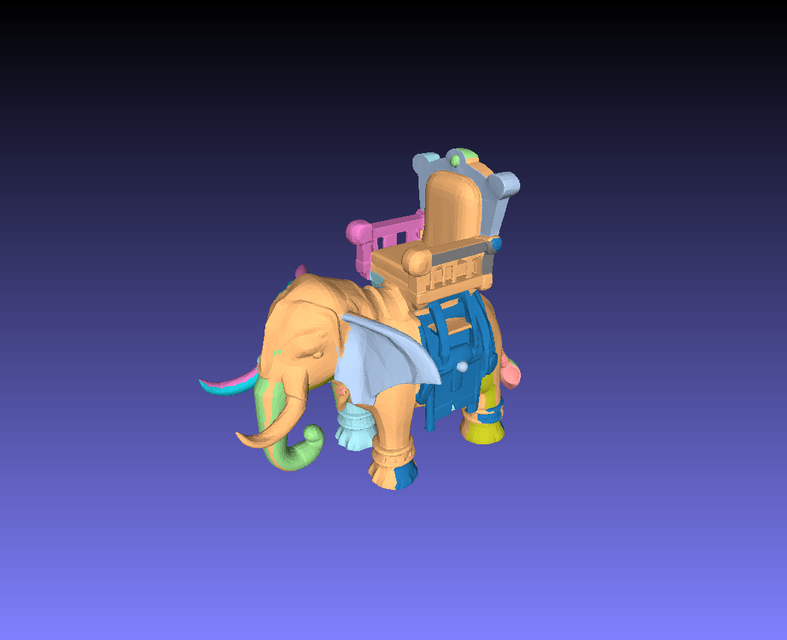
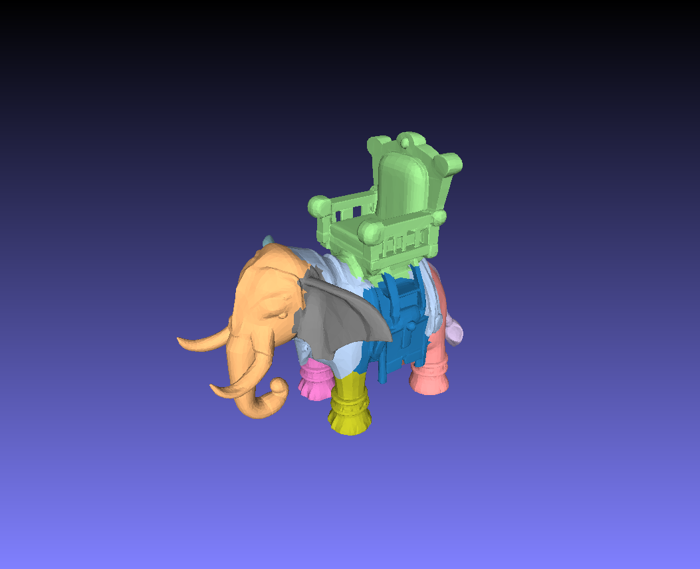
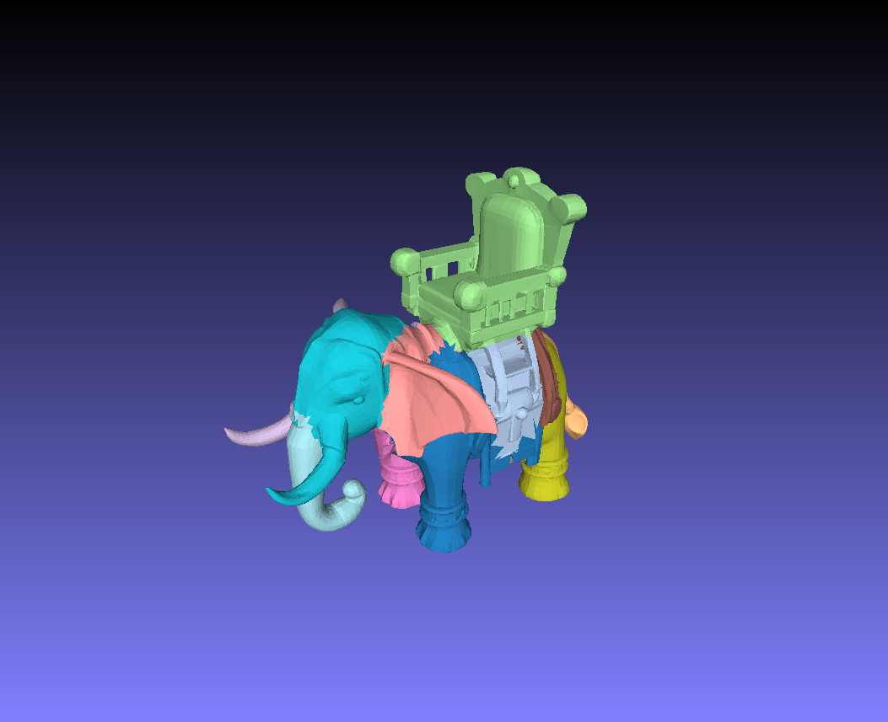
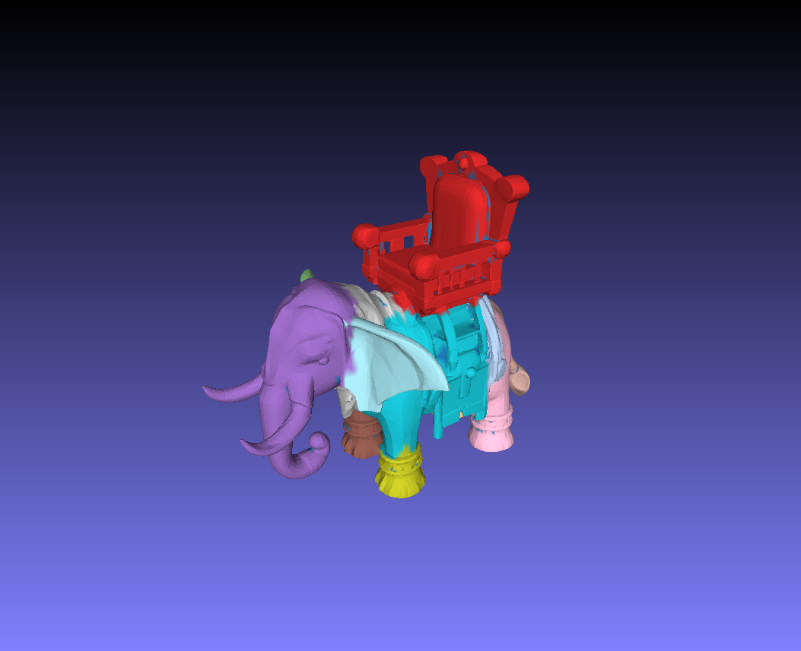

# PartField: Learning 3D Feature Fields for Part Segmentation and Beyond
**[PartField: Learning 3D Feature Fields for Part Segmentation and Beyond](https://research.nvidia.com/labs/toronto-ai/partfield-release/)** 

Minghua Liu*, Mikaela Angelina Uy*, Donglai Xiang, Hao Su, Sanja Fidler, Nicholas Sharp, Jun Gao

## Overview


PartField is a feedforward model that predicts part-based feature fields for 3D shapes. Our learned features can be clustered to yield a high-quality part decomposition that outperforms the latest open-world 3D part segmentation approaches in both quality and speed. Partfield can be applied to a wide variety of inputs in terms of modality, semantic class, and style. The learned feature field exhibits consistency across shapes, enabling applications such as cosegmentation, interactive selection, and correspondence.

## Table of Contents

- [Environment Set-Up](#environment-set-up)
- [Example Run](#example-run)
- [Interactive Tools and Applications](#interactive-tools-and-applications)
- [Evaluation on PartObjaverse-Tiny](#evaluation-on-partobjaverse-tiny)
- [Discussion](#discussion-clustering-with-messy-mesh-connectivities)
- [Citation](#citation)


## Pretrained Model
```
mkdir model
```
Links to download our pretrained model is here: [Trained on Objaverse](https://huggingface.co/mikaelaangel/partfield-ckpt/blob/main/model_objaverse.ckpt). Due to licensing, we are unable to release the model that was also trained on PartNet.

## Environment Set-Up

We use Python 3.10 with Pytorch 2.4 and CUDA 12.4. The environment and required packages can be installed individually as follows:
```
conda create -n partfield python=3.10
conda activate partfield
conda install nvidia/label/cuda-12.4.0::cuda
pip install psutil
pip install torch==2.4.0 torchvision==0.19.0 torchaudio==2.4.0 --index-url https://download.pytorch.org/whl/cu124
pip install lightning==2.2 h5py yacs trimesh scikit-image loguru boto3
pip install mesh2sdf tetgen pymeshlab plyfile einops libigl polyscope potpourri3d simple_parsing arrgh open3d
pip install torch-scatter -f https://data.pyg.org/whl/torch-2.4.0+cu124.html
apt install libx11-6 libgl1 libxrender1
pip install vtk
```

An environment file is also included and can be used for installation:
```
conda env create -f environment.yml
conda activate partfield
```

## TLDR
1. Input data (`.obj` or `.glb` for meshes, `.ply` for splats) stored in a subfolder in `data/`. A new subfolder can be created and files can be copied in for custom data.
2. Extract PartField feature by running the script `partfield_inference.py`, passing the arguments `result_name [FEAT_FOL]` and `dataset.data_path [DATA_PATH]`. Output features can then be found in `exp_results/partfield_features/[FEAT_FOL]`.
3. The segmented parts can be obtained by running the script `run_part_clustering.py`, passing the arguments `--root exp/[FEAT_FOL]` and `--dump_dir [PART_OUT_FOL]`. Output segmentations can then be found in `exp_results/clustering/[PART_OUT_FOL]`.
4. Application demo scripts can be found in `applications/` and can be used after extracting partfield features, i.e. running `partfield_inference.py` on the desired demo data.

## Example Run
### Download Demo Data

#### Mesh Data
We showcase the feasibility of our PartField with some sample meshes from Objaverse (artist created) and Trellis3D (AI generated). Sample data can be downloaded:  
```
sh download_demo_data.sh
```
Downloaded meshes can be found in `data/objaverse_samples/` and `data/trellis_samples/`.

#### Gaussian Splats
We also demonstrate our approach with Gaussian splatting reconstructions as input. Sample data of splat reconstructions from the NeRF dataset can be found [here](https://drive.google.com/drive/folders/1l0njShLq37hn1TovgeF-PVGBBrAdNQnf?usp=sharing). Download the data and place it in the folder `data/splat_samples`

### Extract Feature Field 
#### Mesh Data

```
python partfield_inference.py -c configs/final/demo.yaml --opts continue_ckpt model/model_objaverse.ckpt result_name partfield_features/objaverse dataset.data_path data/objaverse_samples
python partfield_inference.py -c configs/final/demo.yaml --opts continue_ckpt model/model_objaverse.ckpt result_name partfield_features/trellis dataset.data_path data/trellis_samples 
```

#### Point Clouds / Gaussian Splats
```
python partfield_inference.py -c configs/final/demo.yaml --opts continue_ckpt model/model_objaverse.ckpt result_name partfield_features/splat dataset.data_path data/splat_samples is_pc True
```

### Part Segmentation
#### Mesh Data

We use Agglomerative clustering for part segmentation on mesh inputs.
```
python run_part_clustering.py --root exp_results/partfield_features/objaverse --dump_dir exp_results/clustering/objaverse --source_dir data/objaverse_samples --use_agglo True --max_num_clusters 20 --option 0
```

When the input mesh has multiple connected connected components or poor connectivity, defining face adjacency by connecting geometrically close faces can generate better results (see discussion below):
```
python run_part_clustering.py --root exp_results/partfield_features/trellis --dump_dir exp_results/clustering/trellis --source_dir data/trellis_samples --use_agglo True --max_num_clusters 20 --option 1 --with_knn True
```

#### Point Cloud / Gaussian Splats
We use KMeans clustering for part segmentation on point cloud inputs.
```
python run_part_clustering.py --root exp_results/partfield_features/splat --dump_dir exp_results/clustering/splat --source_dir data/splat_samples --max_num_clusters 20 --is_pc True
```

## Interactive Tools and Applications
We include UI tools to demonstrate different applications of PartField. Set-up and try out our demos [here](applications/)!


## Evaluation on PartObjaverse-Tiny


To evaluate on all models in PartObjaverse-Tiny, we can download the data [here](https://github.com/Pointcept/SAMPart3D/blob/main/PartObjaverse-Tiny/PartObjaverse-Tiny.md), and run these commands:
```
python partfield_inference.py -c configs/final/demo.yaml --opts continue_ckpt model/model_objaverse.ckpt result_name partfield_features/partobjtiny dataset.data_path data/PartObjaverse-Tiny/PartObjaverse-Tiny_mesh  n_point_per_face 2000 n_sample_each 10000
python run_part_clustering.py --root exp_results/partfield_features/partobjtiny/ --dump_dir exp_results/clustering/partobjtiny --source_dir data/PartObjaverse-Tiny/PartObjaverse-Tiny_mesh --use_agglo True --max_num_clusters 20 --option 0
```
If an OOM error is thrown, we can reduce the number of points sampled per face, e.g. n_point_per_face 500.

Evaluation metrics can be obtained by running the command below, per category average mIOU was reported in the paper. 
```
python compute_metric.py
```
This evaluation code builds on top of that released by [SAMPart3D](https://github.com/Pointcept/SAMPart3D). Users with their own data with corresponding ground truths can easily modify this script and compute their metrics.

## Discussion: Clustering with Messy Mesh Connectivities
<!-- Some meshes can get messy with a lot of connected components, here the connectivity information may not be useful, causing failure cases when using Agglomerative clustering. In these cases, we provide two alternatives, 1) cluster using KMeans. We provide sample code below, or 2) converting the input mesh to a manifold surface mesh.

Sample data download:
```
cd data
mkdir messy_meshes_samples
cd messy_meshes_samples
wget https://huggingface.co/datasets/allenai/objaverse/resolve/main/glbs/000-007/00790c705e4c4a1fbc0af9bf5c9e9525.glb
wget https://huggingface.co/datasets/allenai/objaverse/resolve/main/glbs/000-132/13cc3ffc69964894a2bc94154aed687f.glb
```

Extract Partfield feature on the original mesh and run KMeans clustering:
```
python partfield_inference.py -c configs/final/demo.yaml --opts continue_ckpt model/model_objaverse.ckpt result_name partfield_features/messy_meshes_samples dataset.data_path data/messy_meshes_samples
python run_part_clustering.py --root exp_results/partfield_features/messy_meshes_samples/ --dump_dir exp_results/clustering/messy_meshes_samples_kmeans/ --source_dir data/messy_meshes_samples --max_num_clusters 20
```

Extract convert mesh into a surface manifold, extract Partfield feature and run agglomerative clustering:
```
python partfield_inference.py -c configs/final/demo.yaml --opts continue_ckpt model/model_objaverse.ckpt result_name partfield_features/messy_meshes_samples_remesh dataset.data_path data/messy_meshes_samples remesh_demo True 
python run_part_clustering_remesh.py --root exp_results/partfield_features/messy_meshes_samples_remesh --dump_dir exp_results/clustering/messy_meshes_samples_remesh --source_dir data/messy_meshes_samples --use_agglo True --max_num_clusters 20 

python run_part_clustering_remesh.py --root exp_results/partfield_features/trellis_remesh --dump_dir exp_results/clustering/trellis_remesh --source_dir data/trellis_samples --use_agglo True --max_num_clusters 20 
``` -->
Some meshes can get messy with multiple connected components. When using Agglomerative clustering for part segmentation, an adjacency matrix is passed into the algorithm and ideally requires the mesh to be a single connected component. In the case where our input mesh is not a single connected component, we add pseudo edges to the adjacency matrix to make it a single connected component. Our default method takes the most simple approach of addine `N-1` pseudo edges as a chain to connect `N` components together. This approach can lead to poor results when the mesh is poorly connected and has multiple connected components, this simple approach can lead to poor results:



```
python run_part_clustering.py --root exp_results/partfield_features/trellis --dump_dir exp_results/clustering/trellis_bad --source_dir data/trellis_samples --use_agglo True --max_num_clusters 20 --option 0
```

When this occurs, we explore different options that can lead to better results:

### 1. Preprocess Input Mesh

We can apply a simple clean up to the input meshes by removing duplicate vertices and faces and merging close vertices with `pymeshlab`. This can be passed as a flag when generating Partfield features:

```
python partfield_inference.py -c configs/final/demo.yaml --opts continue_ckpt model/model_objaverse.ckpt result_name partfield_features/trellis_preprocess dataset.data_path data/trellis_samples preprocess_mesh True
```

When running agglomerative clustering on cleaned up mesh, we can see better parts:



```
python run_part_clustering.py --root exp_results/partfield_features/trellis_preprocess --dump_dir exp_results/clustering/trellis_preprocess --source_dir data/trellis_samples --use_agglo True --max_num_clusters 20 --option 0
```

### 2. Cluster with KMeans 

Perhaps we don't want to modify the input mesh, and would like to avoid preprocessing. Another alternative is to use KMeans clustering which does not depend on an adjacency matrix.



```
python run_part_clustering.py --root exp_results/partfield_features/trellis --dump_dir exp_results/clustering/trellis_kmeans --source_dir data/trellis_samples --max_num_clusters 20 
```

### 3. MST-based Adjacency Matrix 

Instead of simply chaining connected components of the input mesh, we also explored adding pseudo edges to the adjacency matrix by constructing a KNN-graph based with face centroids and computing the minimum spanning tree of the graph.


```
python run_part_clustering.py --root exp_results/partfield_features/trellis --dump_dir exp_results/clustering/trellis_faceadj --source_dir data/trellis_samples --use_agglo True --max_num_clusters 20 --option 1 --with_knn True
```

<!-- ### Remesh with Marching Cubes (experimental)

We also explore computing the SDF of the input mesh and then running marching cubes, resulting in a surface mesh that is guaranteed to be a single connected component. We then run clustering on the new mesh and map back the segmentation labels to the original mesh by a voting scheme.



```
python partfield_inference.py -c configs/final/demo.yaml --opts continue_ckpt model/model_objaverse.ckpt result_name partfield_features/trellis_remesh dataset.data_path data/trellis_samples remesh_demo True

python run_part_clustering_remesh.py --root exp_results/partfield_features/trellis_remesh --dump_dir exp_results/clustering/trellis_remesh --source_dir data/trellis_samples --use_agglo True --max_num_clusters 20 
```-->

### More Challenging Meshes!
These proposed approaches can improve results for some meshes, but we find that there are harder ones that still don't result in satisfying segmentations. We leave this for future work. If interested, these are some examples of challenging meshes we encountered:

Chellenging meshes:
```
cd data
mkdir challenge_samples
cd challenge_samples
wget https://huggingface.co/datasets/allenai/objaverse/resolve/main/glbs/000-007/00790c705e4c4a1fbc0af9bf5c9e9525.glb
wget https://huggingface.co/datasets/allenai/objaverse/resolve/main/glbs/000-132/13cc3ffc69964894a2bc94154aed687f.glb
```

## Citation
```
@inproceedings{partfield2025,
      title={PartField: Learning 3D Feature Fields for Part Segmentation and Beyond}, 
      author={Minghua Liu and Mikaela Angelina Uy and Donglai Xiang and Hao Su and Sanja Fidler and Nicholas Sharp and Jun Gao},
      year={2025}
}
```

## References
PartField borrows the codes from the following repositories:
- [OpenLRM](https://github.com/3DTopia/OpenLRM)
- [Pytorch 3D UNet](https://github.com/wolny/pytorch-3dunet)
- [PVCNN](https://github.com/mit-han-lab/pvcnn)
- [SAMPart3D](https://github.com/Pointcept/SAMPart3D) -- Evaluation script 

Many thanks to the authors for sharing their codes!