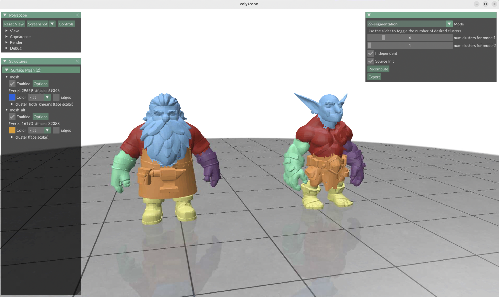
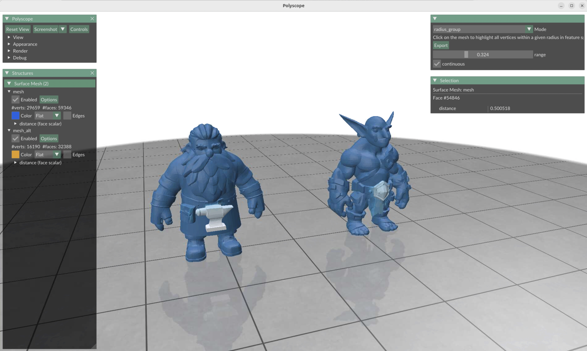
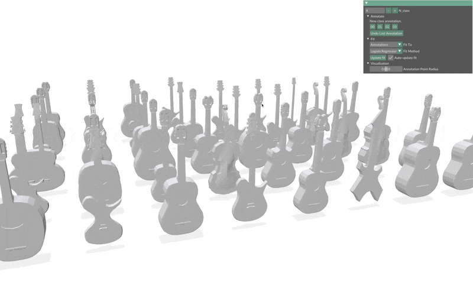

# Interactive Tools and Applications

## Single-Shape Feature and Segmentation Visualization Tool
We can visualize the output features and segmentation of a single shape by running the script below:

```
cd applications/
python single_shape.py --data_root ../exp_results/partfield_features/trellis/ --filename dwarf
```

- `Mode: pca, feature_viz, cluster_agglo, cluster_kmeans`
- `pca` : Visualizes the pca Partfield features of the input model as colors.
- `feature_viz` : Visualizes each dimension of the PartField features as a colormap.
- `cluster_agglo` : Visualizes the part segmentation of the input model using Agglomerative clustering.
    - Number of clusters is specified with the slider.
    - `Adj Matrix Def`: Specifies how the adjacency matrix is defined for the clustering algorithm by adding dummy edges to make the input mesh a single connected component.
        - `Add KNN edges` : Adds additional dummy edges based on k nearest neighbors.
- `cluster_kmeans` : Visualizes the part segmentation of the input model using KMeans clustering.
    - Number of clusters is specified with the slider.


## Shape-Pair Co-Segmentation and Feature Exploration Tool
We provide a tool to analyze and visualize a pair of shapes that has two main functionalities:  1) **Co-segmentation** via co-clustering and 2) Partfield **feature exploration** and visualization. Try it out as follows:

```
cd applications/
python shape_pair.py --data_root ../exp_results/partfield_features/trellis/ --filename dwarf --filename_alt goblin 
```

### Co-Clustering for Co-Segmentation

Here explains the use-case for `Mode: co-segmentation`.



The shape-pair is co-segmented by running co-clustering, In this application, we use the KMeans clustering algorithm. The `first shape (left)` is separated into parts via **unsupervised clustering** of its features with KMeans, from which the parts of the `second shape (right)` are then defined. 

Below are a list parameters:
- `Source init`: 
    - `True`: Initializes the cluster centers of the second shape (right) with the cluster centers of the first shape (left). 
    - `False`: Uses KMeans++ to initialize the cluster centers for KMeans for the second shape.
- `Independent`:
    - `True`: Labels after running KMeans clustering are directly used as parts for the second shape. Correspondence with the parts of the first shape is not explicitly computed after KMeans clustering. 
    - `False`: After KMeans clustering is ran on the features of the second shape, the mean features for each unique part is then computed. The mean part feature for each part of the first shape is also computed. Then the parts of the second shaped are assigned labels based on the nearest neighbor part of the first shape.
- `Num cluster`:
    - `Model1` : A slider is used to specify the number of parts for the first shape, i.e. number of clusters for KMeans clustering.
    - `Model2` : A slider is used to specify the number of parts for the second shape, i.e. number of clusters for KMeans clustering. Note: if `Source init` is set to `True` then this slider is ignored and the number of clusters for Model1 is used.


### Feature Exploration and Visualization

Here explains the use-case for `Mode: feature_explore`.



This feature allows us to select a query point from the first shape (left) and the feature distance to all points in the second shape (left) and itself is then visualized as a colormap.
- `range` : A slider to specify the distance radius for feature similarity visualization. Large values will result in bigger highlighter areas.
- `continuous` : 
    - `False` : Query point is specified with a mouse click.
    - `True` : You can slide your mouse around the first mesh to visualize feature distances.

## Multi-shape Cosegmentation Tool
We further demonstrate PartField for cosegmentation of multiple/a set of shapes. Try out our demo application as follows:

### Dependency Installation
Let's first install the necessary dependencies for this tool:
```
pip install cuml-cu12
pip install xgboost
```

### Dataset
We use the Shape COSEG dataset for our demo. We first download the dataset here:
```
mkdir data/coseg_guitar
cd data/coseg_guitar
wget https://irc.cs.sdu.edu.cn/~yunhai/public_html/ssl/data/Guitars/shapes.zip
wget https://irc.cs.sdu.edu.cn/~yunhai/public_html/ssl/data/Guitars/gt.zip
unzip shapes.zip
unzip gt.zip
```

Now, let's extract Partfield features for the set of shapes:
```
python partfield_inference.py -c configs/final/demo.yaml --opts continue_ckpt model/model_objaverse.ckpt result_name partfield_features/coseg_guitar/ dataset.data_path data/coseg_guitar/shapes
```

Now, we're ready to run the tool! We support two modes: 1) **Few-shot** with click-based annotations and 2) **Supervised** with ground truth labels.

### Annotate Mode


We can run our few-shot segmentation tool as follows:
```
cd applications/
python multi_shape_cosegment.py --meshes ../exp_results/partfield_features/coseg_guitar/
```
We can annotate the segments with a few clicks. A classifier is then ran to obtain the part segmentation.
- N_class: number of segmentation class labels
- Annotate:
    - `00, 01, 02, ...`: Select the segmentation class label, then click on a shape region of that class.
    - `Undo Last Selection`: Removes and disregards the last annotation made.
- Fit:
    - Fit Method: Selects the classification method used for fitting. Default uses `Logistic Regression`.
    - `Update Fit`: By default, the fitting process is automatically updated. This can also be changed to a manual update.

### Ground Truth Labels Mode


Alternatively, we can use the ground truth labels of a subset of the shapes to train the classifier.

```
cd applications/
python multi_shape_cosegment.py --meshes ../exp_results/partfield_features/coseg_guitar/ --n_train_subset 15
```
`Fit Method` can also be selected here to choose the classifier to be used.


## 3D Correspondences

First, we clone the repository [SmoothFunctionalMaps](https://github.com/RobinMagnet/SmoothFunctionalMaps) and install additional packages.
```
pip install omegaconf robust_laplacian
git submodule init
git submodule update --recursive
```

Download the [DenseCorr3D dataset](https://drive.google.com/file/d/1bpgsNu8JewRafhdRN4woQL7ObQtfgcpu/view?usp=sharing) into the `data` folder. Unzip the contents and ensure that the file structure is organized so that you can access
`data/DenseCorr3D/animals/071b8_toy_animals_017`.

Extract the PartField features.
```
# run in root directory of this repo
python partfield_inference.py -c configs/final/correspondence_demo.yaml --opts continue_ckpt model/model_objaverse.ckpt preprocess_mesh True
```

Run the functional map.
```
cd applications/
python run_smooth_functional_map.py -c ../configs/final/correspondence_demo.yaml --opts
```